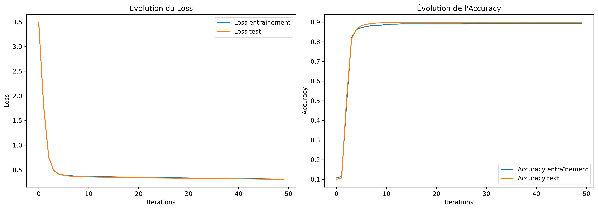

# Classification d'images Fashion-MNIST avec NumPy

## 📌 Description

Ce projet consiste à développer **from scratch un réseau de neurones artificiel avec NumPy** pour réaliser une classification binaire sur la base de données **Fashion-MNIST**.

L'objectif est d'implémenter manuellement les principales étapes de l'apprentissage d'un réseau de neurones, sans utiliser de framework spécialisé de Deep Learning.

## 🎯 Objectif

Fashion-MNIST contient initialement **10 catégories de vêtements**.

Dans ce projet, le problème est simplifié en une classification binaire :

* `1` → T-shirt / Top
* `0` → autres catégories

## 📊 Dataset

Fashion-MNIST contient :

* **60 000 images d'entraînement**
* **10 000 images de test**
* Images en niveaux de gris de **28 × 28 pixels**
* **10 classes** à l'origine

Chaque image est transformée en un vecteur de **784 pixels**.

## 🧹 Prétraitement

Les principales étapes de préparation des données sont :

1. Chargement des fichiers Fashion-MNIST
2. Visualisation des images
3. Normalisation des pixels de `[0, 255]` vers `[0, 1]`
4. Transformation des images `28 × 28` en vecteurs de `784`
5. Transformation du problème en classification binaire

Après prétraitement :

```text
X_train : (784, 60000)
X_test  : (784, 10000)
```

## 🧠 Architecture du réseau

L'architecture utilisée est :

```text
784 → 32 → 32 → 32 → 1
```

| Couche          | Neurones | Rôle                                        |
| --------------- | -------: | ------------------------------------------- |
| Entrée          |      784 | Représenter les pixels de l'image           |
| Couche cachée 1 |       32 | Apprendre des caractéristiques              |
| Couche cachée 2 |       32 | Combiner les caractéristiques               |
| Couche cachée 3 |       32 | Construire une représentation plus complexe |
| Sortie          |        1 | Produire la classification binaire          |

La fonction d'activation utilisée est la **sigmoïde**.

## ⚙️ Algorithmes implémentés

Le réseau neuronal a été entièrement développé avec **NumPy**.

Les principales fonctions implémentées sont :

* Initialisation des poids et des biais
* Propagation avant (*Forward Propagation*)
* Fonction de coût **Log Loss**
* Rétropropagation (*Backpropagation*)
* Descente de gradient
* Prédiction
* Calcul de l'accuracy

### Propagation avant

Pour chaque couche :

```text
Z = W · A + b
A = sigmoid(Z)
```

### Fonction d'activation

```text
sigmoid(z) = 1 / (1 + exp(-z))
```

### Mise à jour des paramètres

```text
W = W - learning_rate × dW
b = b - learning_rate × db
```

## 🏋️ Entraînement

Pour l'expérimentation présentée dans ce projet :

* **1 000 images d'entraînement utilisées**
* **50 itérations**
* Learning rate : **0,1**
* Architecture : `784 → 32 → 32 → 32 → 1`

Le réseau suit l'évolution de :

* la **Loss d'entraînement**
* la **Loss de test**
* l'**Accuracy d'entraînement**
* l'**Accuracy de test**

## 📈 Résultats

Les résultats obtenus sont :

| Mesure                |   Résultat |
| --------------------- | ---------: |
| Accuracy entraînement | **88,6 %** |
| Accuracy test         | **89,0 %** |

Les courbes d'apprentissage sont disponibles dans :

```text
results/figures/
```



## 📁 Structure du projet

```text
projet-fashion-mnist-neurone_numpy/
│
├── data/
│   ├── train-images-idx3-ubyte.gz
│   ├── train-labels-idx1-ubyte.gz
│   ├── t10k-images-idx3-ubyte.gz
│   └── t10k-labels-idx1-ubyte.gz
│
├── notebooks/
│   └── 01_Fashion_MNIST_NumPy.ipynb
│
├── models/
│
├── src/
│
├── results/
│   └── figures/
│       └── courbes_apprentissage.png
│
├── .gitignore
└── README.md
```

## 🛠️ Technologies utilisées

* **Python 3.12**
* **NumPy**
* **Matplotlib**
* **Jupyter Notebook**
* **VS Code**

## 🚀 Installation

Cloner le dépôt :

```bash
git clone https://github.com/Aliousow94/projet-fashion-mnist-neurone_numpy.git
cd projet-fashion-mnist-neurone_numpy
```

Créer et activer un environnement virtuel :

```bash
python -m venv .venv
```

Sous Windows :

```powershell
.venv\Scripts\activate
```

Installer les dépendances :

```bash
pip install numpy matplotlib jupyter
```

Lancer Jupyter :

```bash
jupyter notebook
```

Puis ouvrir :

```text
notebooks/01_Fashion_MNIST_NumPy.ipynb
```

## 🔮 Perspectives

Plusieurs améliorations sont possibles :

* utiliser les **60 000 images d'entraînement** ;
* augmenter le nombre d'itérations ;
* tester différentes architectures ;
* utiliser **ReLU** dans les couches cachées ;
* réaliser une classification des **10 classes originales** ;
* comparer cette implémentation NumPy avec des frameworks de Deep Learning.

## 👨‍💻 Auteur

**Mamadou Aliou SOW**

Licence 3 Informatique
Université Amadou Mahtar Mbow (UAM)

**Domaines :** Data Science · Machine Learning · Deep Learning
